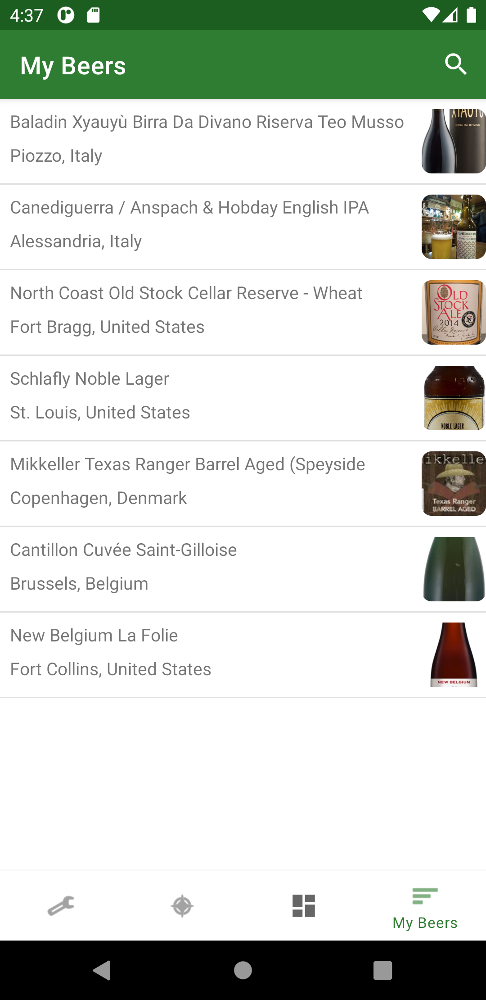

# BeerRate 

 <!--- Spacing -->

  
Initial Project Description

  
Our idea is a beer/alcohol rating app where you can rate different types of alcohol individually and rate it in comparison to others. The alcohol types should ideally be retrieved from an online alcohol database and presented in the app.

It can be used as a platform to see reviews from others to get inspired and educated when you are shopping for alcohol or choosing your drink in a bar.

Furthermore, we were discussing a tinder-like rating system where you swipe right on the drinks you like and swipe left on drinks you dislike. This will result in creating a high score for drinks.

This means that we use these mandatory technologies as a minimum. Of course, we hope to implement more:

* Web Service Calls
* External Libraries
* Android MVVM
* Fragments
* Database
  

BeerRate is a beer rating app. In the app, you will be able to browse beers using a swipe concept similar to that of the Tinder app. Beer suggestions are based on your pre-specified beer type and style preferences. You can search for beers you like to add them to your preference list, and furthermore, you can browse and search for beers in a catalog of beers you liked.

### Project Requirements

* We have to be able to build your project without any extra effort :heavy_check_mark:
* Your project has to be hosted on the GitHub platform :heavy_check_mark:
* Include at least 3 of following: Fragments, Android Service (WorkManager), Threading (Coroutines), Android MVVM, Web service call, External library, Database, Broadcast Receivers, Content Providers :heavy_check_mark:

Of the above BeerRate uses:

| **Requirement**        | **Fulfilled**            | **Description**                                                                              |
|------------------------|:------------------------:|----------------------------------------------------------------------------------------------|
| Fragments              | :heavy_check_mark:       | BeerRate is a single activity app using multiple framgents                                   |
| Threading (Coroutines) | :heavy_check_mark:       | Coroutines are used for database interaction using Kotling Flow and web service calls        |
| Android MVVM           | :heavy_check_mark:       | For supplying views with model data                                                          |
| Web Service Calls      | :heavy_check_mark:       | Retrieval of images                                                                          |
| External Libraries     | :heavy_check_mark:       | Multiple external libraries for fetching images using Glide, Material UI, Dagger Hilt for dependency injection, CardStackView for Tinder-like swipe functionality, etc |
| Database               | :heavy_check_mark:       | Beers, beer styles, and beer types are stored in a database using Room                       |

### Screenshots

  
  
  
  
  
  

### Get Started
1. Clone the project
2. Open the project in Android Studio
3. Choose an emulator (Pixel_3a_API_30_x86 is recommended.)
4. Build and run the app
5. Set your preferences
    * Click edit in either Types of beer or Styles of beer
    * Toogle the types/styles you want
    * Press save
6. Explore beers
    * Swipe left on beers you dislike
    * Swipe right on beers you like
7. View your liked beers
    * Click My Beers
    * All beers you swiped right are present here
    * Search for specific beers by entering part of the name in the top search bar
8. Search for beers
    * Enter part of a beers name
    * Click search
10. Explore the rest of the app on your own :D

© Simon Soele Madsen & Benjamin Eichler Staugaard & Joachim Henrik Bülow & Sofie Louise Madsen
